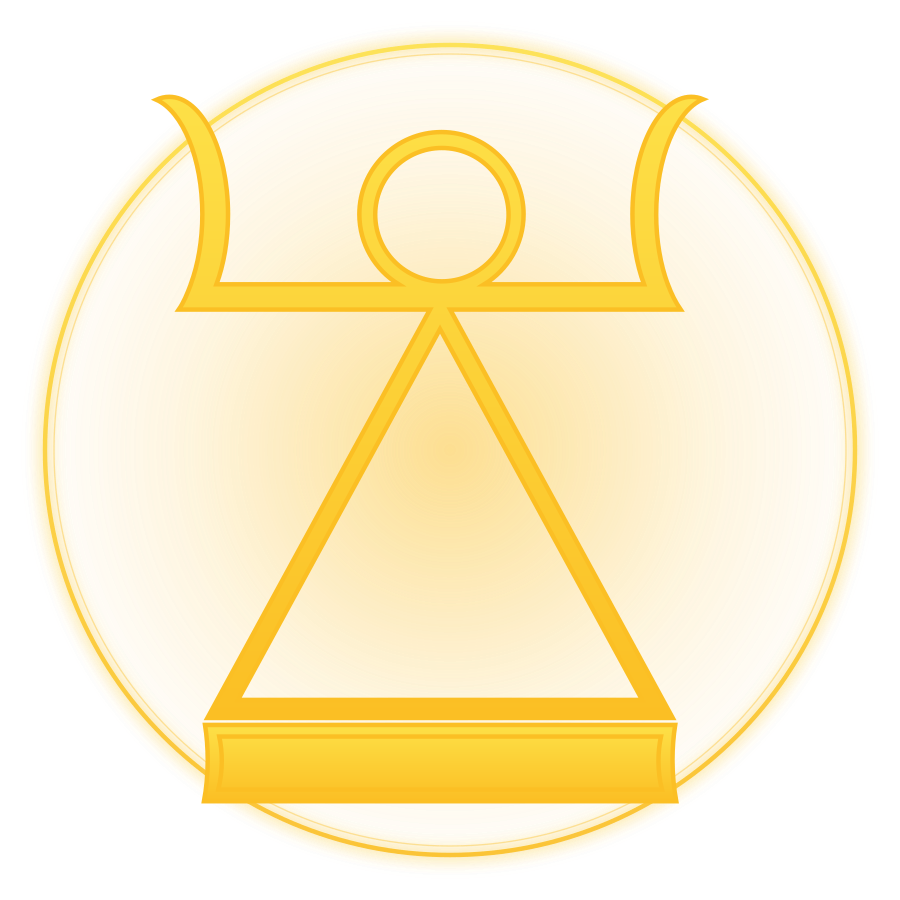
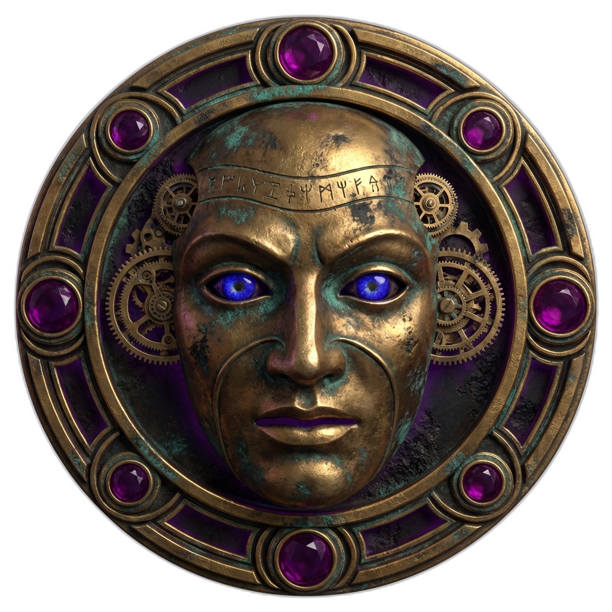

<p align="center">
  
</p>

# Claudicle

**A soul agent framework for Claude Code.**

Clone it. Edit `soul.md`. Run `/ensoul`. Your AI has a personality, memory, and inner life.

Claudicle turns Claude Code into a persistent, soulful orchestrator with three-tier memory, a cognitive pipeline, and channel adapters for Slack, SMS, and terminal. Twelve sub-daimones extend your soul's awareness as specialized crafters. External daimones—autonomous advisors with their own personas and evolution—form a privy council you summon for counsel. It ships with zero skills—pair it with any [skill repo](https://github.com/tdimino/claude-code-minoan) to give your agent capabilities.

An open-source alternative to OpenClaw. Descends from the [Open Souls](https://github.com/opensouls/opensouls) paradigm—see [`docs/open-souls-alignment.md`](docs/open-souls-alignment.md) and [`docs/backstory.md`](docs/backstory.md).

---

## Quick Start

**Prerequisites:** Python 3.10+, [`uv`](https://docs.astral.sh/uv/), and a Claude subscription or `ANTHROPIC_API_KEY`.

```bash
git clone https://github.com/tdimino/claudicle
cd claudicle
./setup.sh --personal    # or --company for team use
```

Then in any Claude Code session:

```
/ensoul
```

That's it. Your session now has a soul.

---

## What Claudicle Does

**Soul Identity** — `/ensoul` activates a persistent personality that survives compaction and resume. Set `CLAUDICLE_SOUL=1` for always-on mode. See [`docs/soul-customization.md`](docs/soul-customization.md).

**Three-Tier Memory** — Working memory (per-thread, 72h TTL), user models (per-user, permanent), soul state (per-soul, permanent). SQLite-backed, git-versioned. Supports checkpoint & rollback via `wm-manage.py`. See [`ARCHITECTURE.md`](ARCHITECTURE.md).

**Cognitive Pipeline** — Every response passes through internal monologue, external dialogue, user model check, dossier check, and soul state check. XML-tagged, verb-narrated. See [`docs/cognitive-pipeline.md`](docs/cognitive-pipeline.md).

**Sub-Daimones** — Twelve specialized agents—the Kotharot, your private army of crafters—extend the soul's awareness with persistent memory. See [`docs/sub-daimones.md`](docs/sub-daimones.md).

**Daimones** — Your privy council. Autonomous advisors with their own personas and evolution, drawn from four sources: a past self, a friend's model, a channeled entity, or a soul your Claudicle has shed. See [`docs/daimones.md`](docs/daimones.md).

**Runtime Modes** — Five modes from `/ensoul`-only to full autonomous daemon. See [`docs/runtime-modes-comparison.md`](docs/runtime-modes-comparison.md).

**Channel Adapters** — Slack, SMS (Telnyx/Twilio), WhatsApp (Baileys). See [`docs/channel-adapters.md`](docs/channel-adapters.md).

**Daimonic Intercession** — How daimones whisper counsel into the cognitive stream—the protocol layer. See [`docs/daimonic-intercession.md`](docs/daimonic-intercession.md).

**Skill-Agnostic** — Ships with zero skills. Discovers capabilities from `~/.claude/skills/` at install time. See [`docs/skill-pairings.md`](docs/skill-pairings.md).

---

## Repository Structure

```
claudicle/
├── subdaimones/  # Sub-daimon definitions (12 with persistent memory)
├── daimones/     # Privy council: example daimon, creation guide
├── daemon/       # Soul engine, cognitive pipeline, memory, monitoring
├── soul/         # Personality files, profiles/, dossiers/
├── hooks/        # Claude Code lifecycle hooks
├── commands/     # Slash commands (/ensoul, /activate, /slack-respond, etc.)
├── scripts/      # Slack utilities, soul infrastructure, wm-manage.py
├── adapters/     # Channel transports (SMS, WhatsApp)
├── docs/         # Architecture and reference docs
├── setup.sh      # Interactive installer
└── LICENSE       # MIT
```

---

## Commands

| Command | Description |
|---------|-------------|
| `/activate` | Full activation: ensoul + daemons + boot sequence |
| `/ensoul` | Activate soul identity in this session |
| `/switch-soul <name>` | Switch active soul profile |
| `/slack-sync #channel` | Bind session to a Slack channel |
| `/slack-respond` | Process pending Slack messages as the soul agent |
| `/thinker` | Toggle visible internal monologue |
| `/daimon` | Summon daimonic counsel |
| `/watcher` | Manage inbox watcher + listener daemon pair |

See [`docs/commands-reference.md`](docs/commands-reference.md) for details.

---

## Documentation

Full index: [`docs/INDEX.md`](docs/INDEX.md)

[Installation](docs/installation-guide.md) | [Soul Customization](docs/soul-customization.md) | [Slack Setup](docs/slack-setup.md) | [Sub-Daimones](docs/sub-daimones.md) | [Extending Claudicle](docs/extending-claudicle.md) | [Environment Variables](docs/environment-variables.md) | [Hooks](docs/hooks.md) | [Troubleshooting](docs/troubleshooting.md)

---

<p align="center">
  
  <br/>
  <em>"Certainty compounds the mind with limits."</em>
</p>

---

## License

MIT. Copyright (c) 2026 Tom di Mino.
